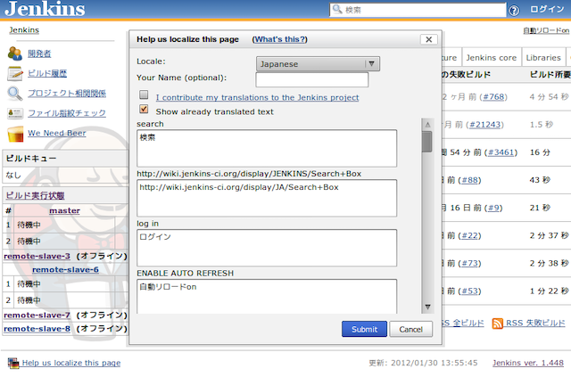

Translation Plugin for Jenkins
=============================

**The server handling submitted translations has been shut down.** While this plugin is still useful for local translations, it's not possible to submit translations to the Jenkins project anymore.

This plugin adds an additional dialog box in every page, which enables people to contribute localizations for the messages they are seeing in the current page. This reduces the barrier of entry to localization, and by showing messages in the context of a page, it should also improve the quality of the translation.

## How does it work?

Browse any page of Jenkins, and you'll see a link in the footer section that opens the translation dialog.  

Click this link, and you'll see an inline dialog box.

Choose the locale that you'd like to contribute, then type the translation text. The message follows the format of [`MessageFormat`](https://docs.oracle.com/javase/6/docs/api/java/text/MessageFormat.html), and in particular,

1.  Markers like "{0}" and "{1}" represent the arguments
2.  Single quote (') needs to be escaped as two single-quote ('')

Your name allows us to recognize your contributions and bypass manual review, especially when you've been contributing in the past. So do supply some unique string, even if it's not your real name.

If you have an administrative access to the Jenkins instance, your contributions will be reflected right away — just reload the page to see the effect. (If you do not have the access, your changes won't be reflected to the running instance for security reasons, but nonetheless they are sent to the Jenkins server.)

Your contributions are also sent to the Jenkins project for inclusion in future versions of Jenkins.

## Participating more to the localization effort

If you'd like to involve more deeply with the localization effort please drop us a note at <http://groups.google.com/group/jenkinsci-dev>. 

Also see [Internationalization](https://wiki.jenkins.io/display/JENKINS/Internationalization).

## Version History

See the [changelog](CHANGELOG.md).

## Release Notes

See [Github Release](https://github.com/jenkinsci/translation-plugin/releases).